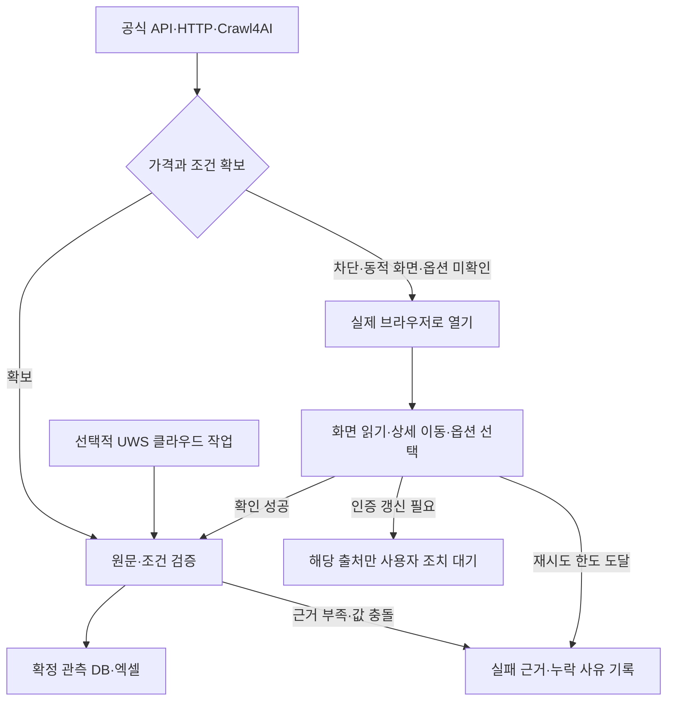

# Browser Fallback & Ultimate Web Scraper Review

> 아래는 설계·서비스 문서 검토 기록입니다. 자체 Playwright 및 MCP 구현·시험 결과는 [구현 상태](docs/IMPLEMENTATION_STATUS.md)를 보세요. UWS 유료 MCP는 연결하지 않았으며 이 문서의 설명은 실행 검증을 뜻하지 않습니다.

확인일: 2026-09-16. 기존 [구현 계획](PLAN.md)과 [오픈소스 분석](OPEN_SOURCE_ANALYSIS.md)에 대한 보완이다.

**권장 구성은 Crawl4AI와 자체 검증·근거 저장을 중심으로 유지하면서, 자동 접근 실패 시 실제 브라우저로 확인하고, Ultimate Web Scraper(UWS)를 선택적 클라우드 수집기로 추가하는 것이다.** UWS는 자동 수집·예약·엑셀 내보내기를 문서상 지원한다. 자체 가격 검증을 대체하는 근거는 확인하지 못했다.

**비용을 반영한 초기 범위: UWS 연결은 보류한다.** 오픈소스와 현재 사용 가능한 브라우저로 수집·검증·엑셀 흐름을 먼저 검증한다. UWS 연결 시험은 UWS 채택을 결정할 때 필요한 선택적 단계이며, 프로젝트 설계나 초기 구현을 진행하기 위한 선행 조건이 아니다.

## 1. 확인한 범위

| 구분 | 확인 결과 |
| --- | --- |
| 공식 기능 문서 | MCP 도구, 연결 방법, 로그인 세션, 예약, 비용·권한 설명 확인 |
| 코드 검토 | 앞선 네 오픈소스의 관련 코드·스키마를 검토했음. UWS MCP 서버 구현 소스는 확보하지 못했으므로 코드 검토를 수행하지 않았음 |
| 실제 브라우저 | Chrome에서 Claude 소개 페이지의 ChatGPT 링크와 기능 제한 FAQ를 클릭해 표시 내용 확인 |
| 실제 MCP 실행 | 현재 세션에 UWS 도구가 연결되어 있지 않아 인증·수집 실행·예약·엑셀 다운로드는 미검증 |
| 차단 페이지 복구 | 특정 차단 사이트의 복구 성공률은 아직 미측정. 이번 브라우저 확인은 소개 페이지 조작 검증 |

이 검토에서 계정 연결, 유료 수집, 세션 복제, 확장 프로그램 설치는 수행하지 않았다.

## 2. UWS로 자동화할 수 있는 범위

| 기능 | 문서상 제공 수단 | 이 프로젝트의 용도 |
| --- | --- | --- |
| 사이트 분석·URL 탐색 | `analyze_website`, `discover_sitemap`, `select_sitemap_urls` | 상품 페이지 후보 확보 |
| 유사 페이지 일괄 수집 | `scrape_pages` | 같은 사이트의 상품 페이지 수집 |
| 쇼핑몰 카탈로그 | `extract_shopify_store`, `extract_catalog` | 지원 쇼핑몰의 상품·옵션 수집 |
| 반복 실행·예약 | `run_automation`, `update_automation` | 검증된 작업의 주기 실행 |
| 상태·부분 결과 조회 | `get_run`, `query_table` | 실패 범위와 확보 자료 회수 |
| 결과 내보내기 | `export_table` | CSV·JSON·Excel 확보 |

카탈로그는 Shopify, WooCommerce, Magento, Salesforce Commerce Cloud를 명시한다. 일반 페이지 수집은 사이트에 존재하는 구조화 데이터와 실제 추출 결과를 표본으로 확인해야 한다. 임의의 산업 사이트에 필요한 모든 클릭 절차를 MCP가 새로 만들어 준다고 보장하지 않는다. 사용자 지정 point-and-click 수집기는 확장 프로그램에서 만든 뒤 클라우드로 보내 실행하는 방식이다. [MCP 도구 문서](https://ultimatewebscraper.com/docs/ai/tools)

AI 연결에는 유료 클라우드 workspace가 필요하다. 무료 확장 프로그램 설치만으로 유료 클라우드 MCP 실행이 포함되는 것은 아니다. 공통 주소는 `https://mcp.ultimatewebscraper.com/mcp`이며, OAuth 연결에서 workspace와 권한을 선택한다. 이 주소는 웹페이지가 아닌 MCP 설정에 입력한다. [연결 문서](https://ultimatewebscraper.com/docs/ai/connect)

예약은 클라우드에서 실행되므로 대화창이 계속 열려 있을 필요가 없다. 예약 주기는 비용을 반복 발생시키므로 출처별 최대 실행 빈도·수집량을 정한다. UI의 예약 시간과 도구가 반환한 다음 실행 시간을 KST로 확인한다. [예약 문서](https://ultimatewebscraper.com/docs/cloud/scheduling), [크레딧 문서](https://ultimatewebscraper.com/docs/cloud/credits-and-plans)

운영 전 확인할 문서 차이도 있다. 소개 페이지와 도구 문서의 페이지 수 한도가 다르고, 도구 문서는 비용이 드는 실행의 확인 단계를 설명하지만 보안 문서에는 기존 작업 재실행 등을 즉시 실행한다고 기술한 부분이 있다. 한도와 확인 절차는 실제 연결된 도구 스키마·preview 응답에서 확인한다. 무인 운영은 처음 검증해 저장한 예약 작업부터 적용한다. [서비스 소개](https://ultimatewebscraper.com/claude), [권한·비용 동작](https://ultimatewebscraper.com/docs/ai/security)

## 3. Claude·ChatGPT에서 공통으로 사용하는 방법

| 환경 | 연결·운영 설계 |
| --- | --- |
| Claude 웹·데스크톱 | UWS custom connector 또는 자체 가격 수집 MCP 연결 |
| Claude Code | HTTP MCP 연결과 별도의 Chrome 연동 사용 가능 |
| ChatGPT 웹 | 지원 계정에서 Developer mode로 원격 MCP 등록, OAuth 연결 |
| 로컬·내부망 수집 | 내부 worker가 실행하고 공통 작업 관리자가 진행·결과를 제공 |

ChatGPT의 Developer mode는 공식 문서상 Plus·Pro·Business·Enterprise·Education의 웹 환경을 지원하며, 조직 설정에 따라 사용 가능 여부가 달라진다. MCP를 연결하는 기능과 사용자 PC 브라우저에 접근하는 기능은 별개다. [OpenAI Developer mode](https://developers.openai.com/api/docs/guides/developer-mode)

Claude Code의 Chrome 연동은 확장 프로그램과 연결된 브라우저에서 실제 클릭·자료 추출을 지원한다. 일반 Claude 대화에 같은 브라우저 권한이 항상 존재한다고 가정하지 않는다. [Claude Code Chrome 문서](https://code.claude.com/docs/en/chrome)

자체 MCP에는 `start_collection`, `get_collection_status`, `get_price_observations`, `get_evidence`, `export_price_report` 같은 업무 도구를 설계한다. 이는 구현 제안이며 UWS의 기존 도구 이름이 아니다. 클라이언트는 같은 작업 ID와 검증된 결과를 읽고, 실제 수집은 지속 실행 worker가 담당한다. 내부 worker 연결은 인증된 중계 구조로 구성하며 내부 포털 자체를 공개하지 않는다.

## 4. 자동 수집이 막혔을 때의 브라우저 동작

여기서 자동 수집 실패는 설계상 처리할 예외를 뜻한다. 이번 조사에서 서비스 소개 페이지가 최종 접근 불가였다는 뜻은 아니다. 실제 실행에서는 다음 상태를 구분한다.

| 상태 | 의미 | 다음 처리 |
| --- | --- | --- |
| 요청 실패 | 요청 거절·시간 초과 등으로 내용을 받지 못함 | 원인과 요청 한도를 확인하고 실제 브라우저 경로 시도 |
| 화면 조작 필요 | 페이지는 열렸지만 옵션 선택·가격표 펼치기 등이 필요함 | 브라우저에서 클릭하고 결과 확인 |
| 인증 필요 | 로그인·추가 인증·세션 갱신 필요 | 사용 가능한 승인된 세션 적용, 필요한 예외만 사용자 조치 대기 |
| 추출 실패 | 화면에 가격이 있지만 수집 규칙이 읽지 못함 | 화면·DOM 대조 후 추출 규칙 수정·검증 |
| 가격 미공개 | 해당 상품·옵션을 확인했지만 가격 대신 문의 등으로 표시됨 | 가격을 비우고 미공개 상태 기록 |

가격 미공개는 접근 실패가 아니다. 브라우저 도구가 없는 경우도 사이트의 접근 거절과 구분한다. 실제 브라우저로 확인한 결과까지 실행 이력에 남긴 뒤 최종 처리 상태를 결정한다.

구현 규칙:

1. AI 읽기 도구의 오류를 곧바로 사이트 전체 접근 불가로 해석하지 않는다. 실행 환경의 실제 브라우저를 열고 새 화면 상태를 확인한다.
2. 상품 상세, 규격·옵션·수량, 가격표 펼치기, 페이지 이동을 클릭한다. 각 조작 후 표시 상품과 가격 조건이 의도한 상태인지 확인한다.
3. 표시 금액, 통화, 가격 유형, 옵션, 계정별 조건, URL, 수집 시각, 근거 위치를 묶는다. 필요한 DOM·응답·스크린샷을 보관하고 인증값은 제외한다.
4. 화면에 없는 숫자는 만들지 않는다. 이미지 숫자를 명확히 판독할 수 없거나 원문과 맞지 않으면 확정 가격은 비우고 검토 상태로 남긴다.
5. 성공한 절차를 출처별로 저장하고 표본 검증 후 재사용한다. 좌표만 고정하기보다 현재 화면의 요소·문구로 대상을 확인한다.
6. 세션 만료·추가 인증·지속 차단은 출처 단위 예외로 처리한다. 브라우저 도구 미연결과 사이트 접근 거절도 별도 상태로 기록한다.

모든 경로는 같은 시도 횟수·시간 예산을 공유한다. 실제 브라우저로도 확인되지 않은 가격을 검색 요약이나 과거 자료로 채우지 않는다. 주문·구매·외부 메시지 발송은 이 수집 절차에 포함하지 않는다.

## 5. 로그인 페이지와 내부 자료

UWS 확장 프로그램은 로컬 로그인 상태를 이용한다. 클라우드 작업에는 별도로 Cookies & Storage 옵션이 있으며, 활성화하면 현재 사이트의 cookies와 localStorage를 클라우드 브라우저에 복제한다. 기본값은 꺼짐이고 복제 세션은 대상 사이트에서 만료될 때까지 유효하다. 문서는 재로그인 상태에서 작업을 다시 만들어 갱신하도록 안내한다. [세션 복제 문서](https://ultimatewebscraper.com/docs/cloud/cookies-and-sessions)

이로부터 다음과 같이 설계한다.

- 공개 사이트: UWS의 적합성과 비용을 표본 평가해 선택한다.
- 외부 공급사 로그인 페이지: 기본은 로컬 브라우저. 인증 자료의 외부 보관 범위가 정해진 출처만 세션 복제를 선택적으로 적용한다.
- 사내 VPN·인트라넷·ERP: 내부망 worker 또는 공식 내부 API로 수집한다. 쿠키 복제만으로 외부 클라우드가 내부망에 도달한다고 가정하지 않는다.
- 로컬 견적서·엑셀·PDF: 기존 파일 수집기로 처리한다.

MCP의 클라우드 연결 자체는 사용자 PC의 열린 탭과 파일을 읽는 권한을 제공하지 않는다. 로컬 화면 조작과 클라우드 수집은 별도 어댑터로 연결한다. [UWS 연결 보안](https://ultimatewebscraper.com/docs/ai/security)

## 6. 도입 순서와 완료 조건

UWS를 연결하지 않고도 자체 수집기의 추출 규칙, 숫자 누락 처리, 원문 근거 연결, 브라우저 조작, 엑셀 출력을 검증할 수 있다. 로컬 표본과 모의 응답은 자체 처리 로직을 검증하는 용도이며, UWS의 실제 동작을 검증한 것으로 간주하지 않는다.

UWS를 채택할 경우에만 실제 연결이 필요한 항목은 계정별 인증·도구 제공 여부, 대상 사이트에서의 수집 결과·처리 시간·소모 크레딧, 클라우드 예약·세션 만료 처리다. 코드와 문서만으로 이 항목의 성공을 확정하지 않는다. 실제 시험을 생략하면 이 항목은 미검증으로 유지하고 UWS를 운영 필수 구성에 넣지 않는다.

1. 기존 수집→원문 저장→가격 검증→엑셀 흐름에 실제 브라우저 대체 경로를 먼저 붙인다.
2. 대표 출처로 일반 상품 페이지, 옵션·수량 선택 페이지, 로그인 페이지, 자동 접근 실패 페이지를 확보한다.
3. UWS 채택의 필요성이 확인된 경우에만 연결 시험을 검토한다. 연결 시 workspace·권한·실제 도구를 확인하고 preview로 수집 필드를 대조한다. 실행 범위와 비용을 정한 표본 작업부터 검증한다.
4. UWS의 결과 행을 자체 관측 모델에 매핑한다. 도구 출력에 원문 위치·수집 시각·거래 조건이 충분하지 않으면 추가 근거를 확보하거나 확정을 보류한다.
5. 출처별 예약 실행 주체를 로컬 또는 UWS 중 하나로 정한다. 자체 관리자는 실행 ID·부분 실패·재시작을 추적하고 원본 결과를 덮어쓰지 않는다.
6. Claude·ChatGPT 각각에서 동일 작업의 진행 상태와 엑셀 결과를 조회한다. 대화 종료, 세션 만료, 크레딧 부족, 차단 지속 상황도 표본 검증한다.

최종 엑셀은 자체 DB에서 생성한다. UWS의 내보내기는 원자료 확보에 활용하며, 원문 가격·계산값·누락·검토 상태를 기존 계획대로 구분한다. 비교 조건이 다른 행을 무조건 중복 삭제하거나 합치지 않는다.

도입 판단 지표는 검증 가격 확보율, 원문 추적률, 상품·조건 오기입, 자동 처리율, 추가 비용, 브라우저 확인 시간이다. UWS가 자체 수집기보다 어떤 출처에서 개선되는지를 실제 표본으로 판단한다. 현재 결론은 **문서상 연동 가능·실행 검증 전인 선택적 수집기**다.
