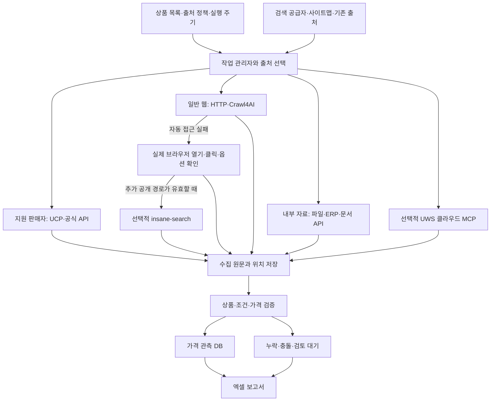

# Open Source Integration Analysis

> 아래는 초기 정적 검토와 설계 제안입니다. 이후 구현한 기능·실행 시험과 현재의 선택 의존성 범위는 [구현 상태](docs/IMPLEMENTATION_STATUS.md), 추가 두 저장소의 소스 검토는 [Agent-Reach·ego-lite 검토](docs/REFERENCE_REVIEW.md)에 기록했습니다.

검토일: 2026-09-16. 대상은 상품 가격 수집, 원문 근거 검증, 권한 있는 내부 자료 연결, 최소 개입 운영, 엑셀 출력이다. 네 저장소의 README와 관련 구현·스키마·의존성 파일을 정적으로 확인했다. 패키지 설치, 데모 실행, 대상 사이트 수집, 성능·정확도 벤치마크는 수행하지 않았다.

## 1. 권장 구성

**Crawl4AI를 웹 수집의 중심에 두고, 자체 가격 검증·근거 저장 계층을 만든다. UCP는 지원 판매자의 구조화 데이터 연결에 사용하고, commerce-agents는 도구·백엔드 분리와 근거 확인 구조를 참고한다. insane-search는 필요성이 입증된 공개 URL의 보조 읽기 경로로 한정한다.**

네 프로젝트를 모두 순서대로 거치는 구성은 피한다. 출처에 따라 가장 적합한 연결 하나를 먼저 선택하고 실패할 때만 다음 경로를 시도한다. API 응답을 이미 확보했다면 같은 가격을 얻기 위해 브라우저를 다시 실행하지 않는다.

추가 요청을 반영해 자동 접근 실패 시 실제 브라우저에서 클릭해 확인하는 경로를 포함한다. Ultimate Web Scraper는 별도 클라우드 서비스로 검토했으며 공개 사이트의 선택적 수집기로 연결한다. 기능·Claude/ChatGPT 연결·로그인 세션·검증 범위는 [BROWSER_MCP_PLAN.md](BROWSER_MCP_PLAN.md)를 참고한다.

| 프로젝트 | 실제 성격 | 도입 판단 | 별도 구현이 필요한 부분 |
| --- | --- | --- | --- |
| commerce-agents | Claude 기반 구매자·판매자 에이전트 참조 구현 | 설계 패턴과 일부 검증 아이디어 참고 | 범용 웹 수집, 내부 자료 커넥터, 가격 근거 이력, 엑셀 |
| UCP | 상거래 기능·데이터·전송 계약의 규격과 스키마 | 지원 판매자에 선택적 연결 | 실제 클라이언트, 지원 출처 관리, 응답 근거 보관 |
| Crawl4AI | 비동기 웹 수집·브라우저·추출 라이브러리 | 핵심 웹 수집기로 채택 | 상품 동일성, 가격 조건 검증, 업무 이력, 보고서 |
| insane-search | 공개 URL을 여러 경로로 읽는 Python 엔진·Claude Code 플러그인 | 후순위의 선택적 보조 도구 | 가격 전용 추출·검증, 내부 인증 자료 수집, 안정적인 배포 포장 |

## 2. 검토한 소스 기준

현재 기본 브랜치에서 확인한 커밋이다. 커밋에 버전 문자열이 있다고 해서 해당 커밋이 배포된 안정 릴리스와 완전히 같다고 가정하지 않는다.

| 프로젝트 | 커밋 | 확인한 코드·문서 기준 |
| --- | --- | --- |
| commerce-agents | [fd4d592](https://github.com/anthropics/commerce-agents/tree/fd4d59224ab96b43c6dc6888207c67b3bd5a24cf) | 2026-08-31, 참조 구현 |
| UCP | [8e600b0](https://github.com/Universal-Commerce-Protocol/ucp/tree/8e600b0588c72d3bf23498bd403ef915cb6b1559) | 2026-09-11, 기본 브랜치 규격 |
| Crawl4AI | [862f6bc](https://github.com/unclecode/crawl4ai/tree/862f6bccb9c063f49b9d42701baa0eea17a4993f) | 2026-08-31, 코드 버전 0.9.3 |
| insane-search | [c020292](https://github.com/fivetaku/insane-search/tree/c020292fedcf1213d815acceacf600402fe72332) | 2026-09-08, 버전 표기 0.16.3 |

## 3. 프로젝트별 기능과 적합성

### commerce-agents: 대화형 업무 구조의 참고 자료

실제 Python 코드와 네 업종의 실행 가능한 데모가 있다. 쇼핑 에이전트의 상품 검색·비교·장바구니·주문 조회, 판매자 에이전트의 분석·재고·가격 변경 제안 등을 보여 준다. 다만 데이터는 가상이며 README는 유지관리하지 않는 참조 구현이라고 명시한다. 기본 제공 MCP 커넥터도 없다. [README](https://github.com/anthropics/commerce-agents/blob/fd4d59224ab96b43c6dc6888207c67b3bd5a24cf/README.md)

`StorefrontBackend`와 `MerchantBackend`는 실제 데이터 연결을 애플리케이션에 맡기는 인터페이스다. `search_products`가 있다는 사실은 인터넷의 모든 판매처를 검색한다는 뜻이 아니다. 우리 시스템이 수집·검증한 데이터를 이 백엔드에 제공할 수는 있다. [백엔드 계약](https://github.com/anthropics/commerce-agents/blob/fd4d59224ab96b43c6dc6888207c67b3bd5a24cf/shopping-agent/core/shopping_agent/backend.py)

도구 결과를 구분해서 전달하고, 세션에서 확인한 상품 ID를 기준으로 동작을 제한하는 구조는 재사용 가치가 있다. 그러나 대화 중 상품 출처 확인과 장기적인 가격 증거 보존은 별개다. 페이지·문서의 원본, 추출 위치, 응답 해시, 수집 시각은 우리 데이터 모델에서 관리해야 한다. [세션 상태와 상품 모델](https://github.com/anthropics/commerce-agents/blob/fd4d59224ab96b43c6dc6888207c67b3bd5a24cf/shopping-agent/core/shopping_agent/types.py)

특히 위 상품 모델은 `price: float`가 필수이고, `currency="USD"`, `in_stock=True`, 배송 선택지의 `fee=0.0` 기본값이 있다. 카탈로그 백엔드가 완전한 정보를 제공한다는 전제에는 맞지만, 누락이 있는 수집 자료에 그대로 적용하면 통화·재고·배송비를 만들어 채우는 결과가 된다. 우리 모델은 미확인값을 `null`로 보존하고 `Decimal`로 금액을 처리한다. 최저 옵션 가격을 상품군 전체의 단일 가격으로 오해하지 않도록 상품군과 실제 옵션도 구분한다.

전체 런타임을 채택하면 Anthropic API·Agent SDK와 해당 구조에 결합된다. 이번 요구에서는 수집·검증 작업을 독립적인 Python 코드로 유지하고, 자연어 질의 기능이 필요할 때 검증된 관측 DB를 읽는 대화형 에이전트를 얹는 편을 권한다. 이는 기능 확인에 근거한 설계 판단이다.

### UCP: 지원 판매자에서 사용할 구조화 데이터 계약

UCP 저장소는 스펙·JSON Schema·REST/MCP 계약이 중심이다. 범용 가격 수집 서버를 설치해서 바로 실행하는 형태가 아니다. 판매자가 `/.well-known/ucp`에 게시한 프로필에서 실제 지원 기능과 엔드포인트를 확인하는 규약이 있다. UCP 프로필이 있다는 사실만으로 상품 검색도 가능하다고 가정하면 안 된다. [프로필 스키마](https://github.com/Universal-Commerce-Protocol/ucp/blob/8e600b0588c72d3bf23498bd403ef915cb6b1559/source/schemas/profile.json)

검토 커밋에는 상품 카탈로그 검색과 상품·옵션·가격의 스키마가 있다. 따라서 checkout 전용 규격으로 취급할 필요는 없다. 판매자가 실제로 카탈로그 검색·조회 기능을 제공한다면 HTML 추출보다 구조가 명확한 읽기 경로로 우선 활용할 수 있다. 다만 업종별 지원 판매자 비율과 엔드포인트 가용성은 조사하지 않았다. [카탈로그 검색](https://github.com/Universal-Commerce-Protocol/ucp/blob/8e600b0588c72d3bf23498bd403ef915cb6b1559/source/schemas/shopping/catalog_search.json), [옵션 모델](https://github.com/Universal-Commerce-Protocol/ucp/blob/8e600b0588c72d3bf23498bd403ef915cb6b1559/source/schemas/shopping/types/variant.json)

가격은 통화 코드와 해당 통화의 최소 단위 정수로 정의한다. 금액을 무조건 100으로 나누지 말고 통화별 자릿수에 맞게 변환해야 한다. 0은 무료 상품을 의미할 수 있으므로 미확인 가격의 대체값으로 쓰지 않는다. [가격 스키마](https://github.com/Universal-Commerce-Protocol/ucp/blob/8e600b0588c72d3bf23498bd403ef915cb6b1559/source/schemas/common/types/price.json)

권장 도입은 버전을 고정한 읽기 전용 UCP 어댑터다. 프로필·capability·전송 방식·인증 조건을 확인하고, 검색·조회 응답과 JSON 필드 위치를 근거로 보존한다. 수량·지역·계정 조건도 함께 저장한다. UCP 응답도 원문 검증과 최신성 확인을 면제하지 않는다. 내부 공통 모델을 UCP의 필수값에 맞추기 위해 누락 가격을 채우지 않는다.

### Crawl4AI: 중심 수집기로 가장 적합

`AsyncWebCrawler`를 중심으로 브라우저 렌더링, CSS/XPath·정규식 추출, 선택적 LLM 추출을 제공한다. 고정된 가격표에는 규칙 기반 추출을 기본으로 쓰고, LLM은 새로운 페이지 구조의 해석이나 후보 규칙 제안에 한정하는 구성을 권한다. 스키마 자동 생성에는 LLM이 사용될 수 있으므로 LLM 없이 실행하는 추출과 구분해야 한다. [추출 구현](https://github.com/unclecode/crawl4ai/blob/862f6bccb9c063f49b9d42701baa0eea17a4993f/crawl4ai/extraction_strategy.py), [LLM 없는 추출 문서](https://docs.crawl4ai.com/extraction/no-llm-strategies/)

확인한 기능은 다음과 같다.

- HTML·정리된 본문·링크·표·선택적 스크린샷·네트워크 기록을 결과로 반환한다. 저장 정책과 가격별 근거 연결은 별도 구현한다. [결과 모델](https://github.com/unclecode/crawl4ai/blob/862f6bccb9c063f49b9d42701baa0eea17a4993f/crawl4ai/models.py)
- 세션·브라우저 프로필과 로그인 상태를 활용할 수 있다. 사내 포털의 승인된 로그인 세션에도 적용 가능하지만 ERP·문서 저장소의 업무용 커넥터가 자동으로 생기는 것은 아니다. [인증·프로필 문서](https://docs.crawl4ai.com/advanced/identity-based-crawling/)
- 도메인별 지연·재시도와 메모리 상태에 따른 동시 실행 구성요소가 있다. 실제 동시성·요청 한도는 출처와 실행 환경에 맞게 설정해야 한다. [dispatcher](https://github.com/unclecode/crawl4ai/blob/862f6bccb9c063f49b9d42701baa0eea17a4993f/crawl4ai/async_dispatcher.py)
- 링크 탐색의 최대 깊이·페이지 수와 중단 후 재개용 상태 콜백이 있다. 상태를 DB에 저장하고 작업을 재시작하는 운영 계층은 우리가 연결한다. [BFS 구현](https://github.com/unclecode/crawl4ai/blob/862f6bccb9c063f49b9d42701baa0eea17a4993f/crawl4ai/deep_crawling/bfs_strategy.py)
- PDF는 별도 전략과 `pypdf` 기반 텍스트 추출이 있다. 이것만으로 스캔 견적서 OCR이나 복잡한 표의 가격 정확성이 해결되지는 않는다. [PDF 처리기](https://github.com/unclecode/crawl4ai/blob/862f6bccb9c063f49b9d42701baa0eea17a4993f/crawl4ai/processors/pdf/processor.py)

URL 후보 수집도 일부 지원한다. 사이트맵·Common Crawl 기반 seeder와 Google 검색 페이지를 읽는 crawler가 있다. 다만 검토한 Google crawler는 `gl=sg&hl=en`을 지정하고 최초 추출 스키마 생성 경로에서 LLM을 사용한다. 국내 산업군 검색에 그대로 적용하는 기본 검색기로 삼기보다, 검색 공급자를 교체할 수 있는 별도 인터페이스를 두는 것이 낫다. Common Crawl은 후보 URL 발견에 사용하고 과거 자료를 현재 가격 근거로 채택하지 않는다. [URL seeder](https://github.com/unclecode/crawl4ai/blob/862f6bccb9c063f49b9d42701baa0eea17a4993f/crawl4ai/async_url_seeder.py), [Google crawler](https://github.com/unclecode/crawl4ai/blob/862f6bccb9c063f49b9d42701baa0eea17a4993f/crawl4ai/crawlers/google_search/crawler.py)

가격 수집용 설정에서 주의할 실제 구현도 있다. 캐시 DB는 URL을 키로 조회한다. 같은 URL이라도 계정·지역·선택 옵션별로 가격이 달라질 수 있으므로 최신 가격 수집은 캐시를 우회하고, 우리 쪽 관측 저장소는 거래 조건을 포함해 구분한다. 검토 버전의 기본 `cache_mode`는 이미 BYPASS이지만 명시적으로 설정한다. `check_robots_txt` 기본값은 False이므로 수집 정책에 따라 명시적으로 켠다. [캐시 DB](https://github.com/unclecode/crawl4ai/blob/862f6bccb9c063f49b9d42701baa0eea17a4993f/crawl4ai/async_database.py), [설정](https://github.com/unclecode/crawl4ai/blob/862f6bccb9c063f49b9d42701baa0eea17a4993f/crawl4ai/async_configs.py)

가격 근거는 가공된 Markdown만 남기지 않고 수집 시점의 HTML 또는 API 응답과 문맥을 보존한다. 네트워크 기록에는 헤더와 요청 데이터가 포함될 수 있으므로 인증값을 제거하고 필요한 가격 응답만 보관한다. [브라우저 수집 구현](https://github.com/unclecode/crawl4ai/blob/862f6bccb9c063f49b9d42701baa0eea17a4993f/crawl4ai/async_crawler_strategy.py)

### insane-search: 공개 URL의 보조 접근 경로

실제 `fetch()`·`fetch_many()` 구현이 있고, 공개 API·피드·URL 변형·HTTP 클라이언트·브라우저를 단계적으로 시도한다. 결과에는 최종 URL, 시도 기록, 추출 경로, 실패 사유를 담는다. 접근 실패 원인 진단에 유용하다. 하지만 성공은 읽을 수 있는 콘텐츠 확보를 뜻하며 상품 가격의 정확성·최신성 검증을 뜻하지 않는다. [fetch 체인](https://github.com/fivetaku/insane-search/blob/c020292fedcf1213d815acceacf600402fe72332/skills/insane-search/engine/fetch_chain.py)

범용 상품 검색 엔진으로 보면 안 된다. X 전용 검색 구현은 있지만 대부분의 경로는 입력 URL의 공개 본문을 읽는다. X 검색에는 선택적 외부 API 경로도 있으므로 모든 기능이 항상 API 키 없이 동작한다고 일반화하지 않는다. [X 검색 코드](https://github.com/fivetaku/insane-search/blob/c020292fedcf1213d815acceacf600402fe72332/skills/insane-search/engine/x_search.py)

로그인·유료 접근이 필요한 자료에는 인증 필요 상태를 반환하고 내부 주소 접근도 제한한다. 사내망·SSO·내부 견적 자료는 이 경로에 보내지 않는다. 외부 읽기 서비스나 보관본에서 얻은 콘텐츠도 원출처·시점을 확인하기 전에는 현재 가격으로 승인하지 않는다. [프로젝트 범위](https://github.com/fivetaku/insane-search/blob/c020292fedcf1213d815acceacf600402fe72332/README.md)

가격·통화·옵션·조건을 근거 위치와 묶는 전용 모델은 없다. 또한 플러그인 중심의 배치와 일부 런타임 의존성 설치 경로가 있어, 운영에 쓸 경우 버전과 의존성을 고정한 어댑터로 감싸야 한다. 이미 Crawl4AI에서 브라우저로 시도한 요청을 보조 도구가 다시 같은 방식으로 반복하지 않도록 전체 시도 예산을 공유한다. [executor](https://github.com/fivetaku/insane-search/blob/c020292fedcf1213d815acceacf600402fe72332/skills/insane-search/engine/executor.py)

## 4. 권장 아키텍처

commerce-agents에서 참고할 백엔드 분리·도구 결과 근거 확인 방식은 작업 관리자와 선택적 대화 UI에 적용한다. 전체 commerce 런타임을 위 흐름의 필수 의존성으로 넣지 않는다.

초기 구현은 한 Python 프로젝트에 모듈을 나누고, 브라우저 작업만 독립 worker 프로세스로 격리하는 구성을 권한다. HTTPX는 API 호출, Crawl4AI는 브라우저 수집을 담당한다. 저장소는 SQLite로 시작하고 여러 worker의 동시 쓰기가 필요해질 때 PostgreSQL과 작업 큐를 검토한다. 초기에 네 개의 독립 서비스를 모두 운영할 필요는 없다.

Claude·ChatGPT에는 같은 작업·관측 DB·엑셀 생성 기능을 MCP로 노출한다. 화면 조작은 각 실행 환경에 맞는 어댑터가 담당한다. UWS의 클라우드 MCP 연결이 사용자 PC의 열린 탭을 직접 제어하는 기능까지 제공한다고 가정하지 않는다. 내부망 출처는 내부 worker로 전달한다.

## 5. 우리가 직접 구현할 핵심

### 가격 관측 모델

`Product`와 `PriceObservation`을 분리한다. 상품은 존재하지만 가격은 없을 수 있다. 내부 공통 모델을 판매 플랫폼의 필수 가격 모델에 맞추지 않는다.

| 필드 묶음 | 내용 |
| --- | --- |
| 상품 식별 | 제조사, 모델·부품번호, 규격, 옵션, 포장 수량·단위 |
| 원문 가격 | 원문 문자열, 확인된 금액 또는 null, 통화 또는 null, 단일가·범위·시작가 유형 |
| 거래 조건 | 판매처, 수량 구간, 세금·배송·할인·회원 조건, 지역, 계정별 가격 맥락 |
| 시점 | 원문 기준일, 유효기간, 실제 수집 시각, 캐시·보관본 여부 |
| 근거 | 요청·최종 URL 또는 문서 ID, 응답/파일 해시, DOM·JSON 경로·페이지·셀 위치, 원문 발췌 |
| 검증 | 숫자 확인 상태, 상품 매칭 상태, 조건 완비 여부, 비교 가능 여부, 제외 사유 |

검증되지 않은 OCR·LLM 숫자는 확정 가격 필드에 쓰지 않는다. 원문을 보존하고 검토 상태를 기록한다. 단위 환산은 확인된 입력값과 식을 갖는 별도 계산 열로 유지한다. 비교할 수 있는 최신 관측만 집계하고, 평균·중앙값을 계산할 때 같은 판매처의 반복 수집을 중복 표본으로 세지 않는다.

### 필요한 추가 모듈

- **출처 발견·관리:** 제조사·판매처·내부 자료 목록, 검색 공급자 교체, 관련성·중복·허용 경로 확인. 정기 수집 때마다 인터넷 전체를 재탐색하지 않고 기존 출처를 우선 갱신한다.
- **산업군별 추출 규칙:** 상품 동일성, 모델 옵션, 단가·총액·할인가·수량 구간의 구분. 첫 발견에만 AI 지원을 쓰고 검증된 규칙을 다음 실행에서 재사용한다.
- **근거 검증:** 숫자·통화·상품·조건이 같은 원문 맥락에 속하는지 확인. 출처가 다른 필드를 이어 붙여 완전한 견적을 만들지 않는다.
- **내부 커넥터:** 공유 폴더, SharePoint·Drive, ERP 읽기 연결, 인증 갱신, 문서 개정·권한·보관기간 처리. 공개 URL reader와 내부 연결의 자격증명을 분리한다.
- **지속 실행:** 작업 상태, 재시도 한도, 도메인별 속도, 중단 후 재개, 출처 구조 변경 감지, 예외 묶음 알림.
- **엑셀:** 기존 PLAN의 여섯 시트, 숫자와 빈 셀 구분, 근거 링크, 최신 비교·전체 이력·누락 현황. XLSX 생성은 별도 보고서 코드로 담당한다.

## 6. 도입 순서와 평가 기준

1. 자체 가격·근거 모델과 검증기를 먼저 정의한다. 공개 API/정적 페이지/동적 옵션 페이지/텍스트 PDF/스캔 문서/내부 자료의 소규모 표본을 확보한다.
2. Crawl4AI와 직접 HTTP 수집으로 일반 웹부터 연결하고, 지정 내부 폴더를 동일한 관측 모델에 연결한다. 엑셀까지 전체 흐름을 검증한다.
3. 실제 UCP 지원 판매자가 확인되면 해당 출처를 읽기 전용 UCP 어댑터로 연결한다. 지원하지 않는 출처의 구현을 기다리게 하지 않는다.
4. 기존 수집기의 실패 URL에서 insane-search가 추가로 확보하는 유효 자료 수, 추가 실행 시간, 근거 보존 품질을 비교한다. 유효한 개선이 있을 때만 해당 도메인에 활성화한다.
5. 자연어 요청·후속 조사 기능이 필요하면 commerce-agents의 백엔드와 근거 확인 패턴을 적용한 대화 계층을 추가한다.

평가 지표는 페이지 접속 성공률, 정확한 상품·가격 추출률, 거래 조건 완비율, 현재 가격 확보율, 근거 연결률, 실행 시간·비용, 사람 검토 건수를 분리한다. 접속 성공률 상승만으로 가격 데이터 품질이 좋아졌다고 판단하지 않는다.

반드시 확인할 사례: 가격 미공개, 통화 누락, 원문 0의 의미, 옵션 최저가, 수량별 단가, 세금·배송 미확인, 서로 다른 계정의 같은 URL, 캐시·보관본, OCR 소수점 오독, HTML과 JSON-LD 불일치, UCP 최소 통화단위, 인증 만료, 부분 실패와 재시작. 확정 가격의 근거 연결은 100%를 요구하고, 정확도는 실제 원문 대조 표본으로 측정한다.

## 7. 배포·유지보수 판단

commerce-agents와 UCP는 Apache-2.0, insane-search는 MIT로 표시되어 있다. Crawl4AI는 Apache-2.0으로 표기하지만 검토한 LICENSE에는 추가 저작자 표시 문구도 있으므로 배포 시 해당 내용을 함께 확인해야 한다. [Crawl4AI LICENSE](https://github.com/unclecode/crawl4ai/blob/862f6bccb9c063f49b9d42701baa0eea17a4993f/LICENSE)

실제 의존성은 검증한 버전으로 고정한다. Crawl4AI는 Playwright 외에도 여러 추출·LLM 관련 의존성이 있고, commerce 런타임 전체를 가져오면 별도의 모델 SDK와 실행 구조도 추가된다. 사용하지 않는 런타임을 필수 의존성으로 묶지 않는 것이 유지관리 범위를 줄인다. [Crawl4AI 의존성](https://github.com/unclecode/crawl4ai/blob/862f6bccb9c063f49b9d42701baa0eea17a4993f/pyproject.toml), [commerce 의존성](https://github.com/anthropics/commerce-agents/blob/fd4d59224ab96b43c6dc6888207c67b3bd5a24cf/requirements.txt)

남은 결정은 대상 산업군·상품, 실제 판매처의 UCP/API 제공 여부, 내부 자료 위치와 권한, 실행 주기다. 이 정보가 확보되면 표본 검증으로 커넥터 수·예외율·운영비를 산정한다.
