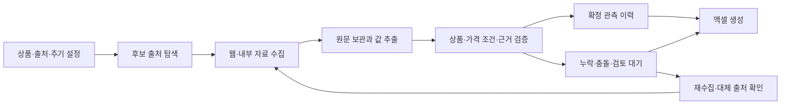

# Price Collection Agent — Implementation Plan

> 구현 전 설계 기록입니다. 현재 코드는 HTTP/파일 → 선택적 브라우저 → 검증 → SQLite/Excel 흐름을 제공합니다. 실행 방법과 실제 검증·미구현 범위는 [README](README.md)와 [구현 상태](docs/IMPLEMENTATION_STATUS.md)를 기준으로 보세요. Crawl4AI·UCP·유료 서비스는 운영 검증을 마친 필수 구성으로 간주하지 않습니다.

작성일: 2026-09-16. 이 문서는 구현 제안이며, 실제 가격 수집이나 내부 시스템 연결은 아직 수행하지 않았다.

네 오픈소스의 기능 분석을 반영한 상세 설계 판단은 [OPEN_SOURCE_ANALYSIS.md](OPEN_SOURCE_ANALYSIS.md)에 정리했다. 웹 수집은 Crawl4AI를 중심으로 구성하고, UCP는 지원 판매자 연결, commerce-agents는 구조 참고, insane-search는 선택적 공개 URL 보조 읽기에 사용한다.

브라우저 직접 클릭 경로와 Ultimate Web Scraper(UWS) MCP 검토는 [BROWSER_MCP_PLAN.md](BROWSER_MCP_PLAN.md)에 추가했다. 자동 수집이 막히면 사용 가능한 실제 브라우저에서 확인하며, UWS는 공개 사이트의 선택적 클라우드 수집기로 연결한다. Claude와 ChatGPT는 같은 수집 작업·검증·보고서를 호출하도록 설계한다.

비용을 반영해 초기 버전에서는 UWS 연결을 보류한다. 오픈소스와 브라우저로 기본 흐름을 먼저 검증하며, UWS의 유료 연결·실행 시험은 채택 필요성이 확인된 경우에만 진행하는 별도 단계다.

목표는 산업군별 상품 가격을 정기적으로 수집하고, 원문 근거와 비교 조건을 검증한 뒤 엑셀로 제공하는 것이다. 사람은 초기 범위·연결 설정과 자동으로 해소되지 않는 예외를 처리한다. 숫자를 많이 채우는 것보다 근거가 있는 값과 없는 값을 정확히 구분하는 것을 우선한다.

## 1. 초기 범위와 완료 정의

산업군과 상품은 아직 미정이다. 첫 버전의 제안 범위는 산업군 1개, 상품 20~50개, 공개 출처 3~5개, 내부 공유 폴더 1개, 일 1회 실행이다. 이는 실제 요구사항이 아니라 범위를 조정하기 위한 출발점이다.

- 산업군별 설정: 상품 목록, 모델·규격·별칭, 동일 상품 판정 필드, 국가·지역, 통화, 거래 단위, 비교할 가격 종류, 수집 주기, 자료 유효기간.
- 출처별 설정: 허용 도메인·경로, 수집 방식, 읽기 권한, 실행 간격, 요청 한도, 자료 유형, 파서 버전.
- 결과: 실행별 엑셀, 원문 근거 보관소, 가격 관측 이력, 출처별 처리 현황, 검토가 필요한 예외 목록.
- 완전성: 정한 상품·출처·기간에 대해 확인 여부와 누락 이유를 설명할 수 있어야 한다. 인터넷 전체의 가격 발견이나 모든 상품의 가격 확보를 보장하지 않는다.
- 수치 정확성: 모든 확정 숫자는 원문 또는 명시적인 계산 근거로 추적 가능해야 한다. 원문이 실제 거래 가격까지 보증하는 것은 아니므로 게시가·견적가·실거래가를 구분한다.

## 2. 전체 흐름

반복 탐색은 상품별 출처 수·시간·비용·재시도 횟수 한도를 둔다. 한도에 도달하면 미확인 사유를 기록하고 실행을 완료한다. 한 출처의 장애 때문에 다른 출처의 수집과 결과 생성을 막지 않는다.

## 3. 수집 방식

### 공개 자료

1. 제조사·공식 유통사·판매처·공개 가격표에서 후보를 찾는다. 검색 API, 사이트맵, 상품 목록과 기존 출처 목록을 활용한다.
2. 제공되는 공식 API나 구조화된 상품 자료를 먼저 읽는다. HTML 내부의 JSON-LD는 추출 경로로 활용하되 화면의 상품 옵션과 가격 조건에 맞는지 확인한다.
3. 일반 페이지는 HTTP로 수집하고, 자바스크립트 실행이 필요한 페이지는 Crawl4AI로 렌더링한다. AI용 읽기 도구나 자동 수집이 막히면 실제 브라우저를 열어 링크·옵션·페이지 이동을 직접 클릭하고 표시된 가격과 조건을 확인한다.
4. PDF·엑셀 가격표를 읽고, 스캔 문서는 OCR로 후보 텍스트를 추출한다.
5. 검색 결과 요약은 탐색에만 사용하며 현재 가격의 확정 근거로 쓰지 않는다.

구조화된 가격 항목에는 가격, 통화, 판매자, 재고, 유효기간 등이 있다. 사이트가 해당 항목을 모두 제공한다고 가정하지 않는다. [Schema.org Offer](https://schema.org/Offer)

사이트별 이용 조건·robots 정책·요청 한도를 설정에 반영하고 요청 간격을 둔다. 자동 수집 실패만으로 최종 접근 불가를 판정하지 않는다. 브라우저 경로를 시도하고도 실패했는지, 해당 실행 환경에 브라우저 도구가 없는지, 인증 갱신이 필요한지를 나눠 기록한다.

### 브라우저 직접 확인과 클라우드 수집

- 실제 브라우저에서는 화면 상태를 읽은 뒤 상품 상세 이동, 규격·수량 선택, 가격표 펼치기 등을 수행한다. 선택한 옵션, 계정 조건, URL, 수집 시각, 원문 위치와 화면 근거를 관측치에 연결한다.
- 성공한 클릭 순서는 출처별 재사용 절차로 저장하고 표본 검증 후 반복 실행에 사용한다. 구조 변경 시 재검증하며, 같은 실패를 무한히 반복하지 않는다.
- 로그인·추가 인증 등 사람의 조치가 필요한 예외는 해당 출처만 보류한다. 브라우저가 있다는 이유로 모든 차단이 해소된다고 가정하지 않는다.
- UWS는 사이트 탐색, 상품 수집, 저장된 작업의 반복 실행, 결과 내보내기를 제공하는 선택적 유료 클라우드 연결이다. 지원 기능과 연결 조건은 별도 검토 문서에 기록했다. UWS 결과도 자체 검증을 통과해야 최종 가격표에 포함한다.
- 사내망과 내부 자료는 로컬 worker를 기본으로 한다. UWS의 선택적 세션 복제는 인증 자료를 외부 클라우드로 보내는 별도 설정이며, 내부 자료 수집 권한만으로 활성화하지 않는다.

### 내부 자료

내부 자료는 사용자가 소유하거나 접근·수집 권한을 가진 자료를 뜻한다. 초기에는 지정 공유 폴더의 견적서·단가표·거래명세서부터 연결하고, 필요에 따라 다음 경로를 추가한다.

| 자료 | 연결 방법 | 확인할 내용 |
| --- | --- | --- |
| 로컬·사내 공유 폴더 | 허용 폴더의 파일 읽기 | 파일 개정본, 문서 날짜, 견적 유효기간 |
| SharePoint·OneDrive·Drive | 공식 API | 읽기 범위, 변경 파일, 권한 회수 |
| ERP·구매 시스템 | 제공 API 또는 읽기 전용 조회 | 거래처, 수량, 세금, 계약 조건, 취소·정정 |
| 사내 포털·공급사 로그인 페이지 | 승인된 계정과 브라우저 세션 | 계정별 가격 조건, 세션 만료 |
| 견적 이메일 | 지정 사서함·폴더의 읽기 연결 | 발신처, 첨부 문서 버전, 유효기간 |

SharePoint·OneDrive는 변경 추적 API를 이용한 증분 동기화를 검토한다. 변경 목록은 모든 중간 개정 이력을 보장하지 않으므로 수집 시점과 확보한 버전을 따로 보관한다. [Microsoft Graph driveItem delta](https://learn.microsoft.com/en-us/graph/api/driveitem-delta?view=graph-rest-1.0)

로그인 상태는 재사용하되 인증 정보는 보고서·로그·소스 저장소에 넣지 않는다. 추가 인증이나 권한 갱신이 필요한 경우에만 사용자의 조치를 요청한다. [Playwright 인증 상태 관리](https://playwright.dev/python/docs/auth)

사내망 자료가 있으면 수집기는 사내 PC나 서버에서 실행한다. 내부 원문을 외부 AI로 보내는 기능은 기본 비활성화하고, 허용 범위가 정해졌을 때만 사용한다. 보고서와 원문 접근도 원래 허용된 대상에 맞추고, 권한 회수·삭제·보관 만료 처리를 정의한다.

## 4. 숫자를 만들어 넣지 않는 규칙

| 상황 | 기록 방식 | 비교·집계 |
| --- | --- | --- |
| 원문에 상품·가격·통화·가격 기준이 확인됨 | 원문 숫자와 근거를 저장 | 비교 조건을 충족할 때 포함 |
| 가격 미공개·문의 필요 | 가격은 비워 두고 사유 기록 | 제외 |
| 통화·포장 수량·세금 조건 일부 불명 | 확인된 원문값만 저장하고 미확인 필드 표시 | 불명 조건에 영향을 받는 비교에서 제외 |
| 범위 가격·최저 시작가 | 범위의 양 끝 또는 시작가를 해당 유형으로 저장 | 단일 확정가와 혼합하지 않음 |
| OCR·AI가 추출했지만 검증되지 않음 | 원문 근거와 검토 상태 보관, 확정 가격 셀은 비움 | 제외 |
| 같은 출처·같은 조건의 표시값이 상충 | 각각의 원문을 보존하고 충돌 표시 | 해소 전 제외 |
| 과거 가격만 존재 | 당시 관측 이력으로 보존 | 현재 가격으로 대체하지 않음 |
| 단위·환율 환산 | 확인된 입력, 계산식, 기준일·환율 출처와 함께 별도 계산 열에 저장 | 계산값임을 표시하고 비교 조건 확인 |

가격 미확인을 0으로 채우지 않는다. 원문에 0이 있어도 무료 제공인지 자리표시자인지 확인하지 못하면 확정하지 않는다. 배송비가 없다는 이유로 무료배송으로 간주하지 않는다. 세금·할인·환율을 관행이나 AI의 배경지식으로 채우지 않는다.

AI는 상품 별칭 탐색, 비정형 문서 해석, 추출 후보 제시에 사용한다. AI가 제시한 신뢰도만으로 숫자를 확정하지 않는다. 원문에서의 위치와 해당 상품·거래 조건의 연결을 검증하는 코드가 확정 여부를 결정한다. 웹페이지나 문서 안의 지시문은 수집 데이터로만 취급한다.

## 5. 상품과 가격의 동일성

산업군마다 필수 규격을 설정한다. 예를 들어 소재는 재질·등급·치수·중량 단위가, 전자 부품은 제조사·부품번호·패키지·포장 수량이 중요할 수 있다. SKU는 판매처별 코드이므로 서로 다른 판매처의 SKU가 같다고 동일 상품으로 합치지 않는다.

최소 기록 항목은 다음과 같다.

- 상품: 내부 상품 ID, 원문명, 제조사, 모델·부품번호, 규격, 옵션, 포장 수량과 단위, 신품·중고 등 상태.
- 거래: 판매처, 지역, 통화, 게시가·견적가·실거래가 구분, 세금, 배송, 할인·회원 조건, 수량 구간·최소 주문량, 필요 시 인도 조건.
- 시간: 원문 작성·가격 기준일, 유효기간, 실제 수집 시각. 원문 날짜가 없으면 수집 날짜로 대신 채우지 않는다.
- 근거: URL 또는 문서 ID·버전, 페이지·표·셀·문구 위치, 원문 발췌, 저장본 식별자와 해시, 추출 방식·버전.
- 품질: 값 검증 상태, 필수 항목 충족 여부, 비교 가능 여부, 제외·누락 사유.

하나의 행은 하나의 판매처·상품·거래 조건·시점에 대한 관측치다. 판매처별 가격 차이는 정상적인 관측이며 그 자체로 충돌이 아니다. 서로 다른 견적의 조건과 숫자를 결합해 가상의 완전한 견적을 만들지 않는다.

현재 가격 비교에는 동일 조건의 최신 유효 관측치를 판매처별로 선택한다. 같은 판매처의 과거 이력이나 재게시된 동일 자료가 평균·중앙값을 중복 가중하지 않도록 한다. 재고가 없거나 유효기간이 지난 가격은 별도로 표시한다.

## 6. 자동 운영과 사람의 역할

초기에는 상품·출처 범위, 로그인 연결, 비교 기준, 보고서 저장 위치만 설정한다. 이후에는 다음 작업을 자동화한다.

- 정기 실행, 변경 자료 재수집, 출처별 요청 속도 조절, 제한된 재시도와 중단 후 재개.
- 자동 수집 실패 시 브라우저 직접 확인, 검증된 클릭 절차 재사용, 선택적 UWS 작업 상태·부분 결과 회수.
- 누락 항목의 대체 출처 탐색. 확인되지 않은 값은 계속 빈 상태로 유지.
- 출처별 수집 건수 급감, 필수 필드 소실, 페이지 구조 변경, 갑작스러운 가격 변화 감지.
- 기존 수집 결과와 실행 ID를 이용한 중복 방지, 이전 가격·근거 이력 보존.
- 검증을 통과한 결과로 엑셀 생성 후 정상 파일인지 확인하고 최신 보고서 갱신.
- 일부 출처가 실패하면 보고서에 실패 범위와 최종 성공 시각을 표시. 예전 값을 새 수집 결과처럼 표시하지 않음.

사이트 구조 변경 시 새 추출 규칙은 먼저 표본으로 검증한다. 검증이 안 되면 해당 출처만 보류한다. 평상시에는 정기 결과를 생성하고, 인증 만료·지속 실패·자료 충돌처럼 조치가 필요한 예외를 묶어서 알린다. 가격 문의 메일이나 주문은 수집 작업에 포함하지 않는다.

## 7. 엑셀 산출물

| 시트 | 내용 |
| --- | --- |
| 실행 요약 | 실행 시각, 수집 범위, 성공·실패 출처, 가격 확보율, 조건 완비율, 주요 변경 |
| 상품 목록 | 수집 대상 전체, 상품 식별 기준, 확인하지 못한 상품 포함 |
| 최신 가격 비교 | 같은 상품·조건별 최신 가격, 판매처, 비교 제외 사유, 비교 가능한 자료의 최저·최고·중앙값과 표본 수 |
| 전체 관측 이력 | 출처별 원문 가격과 조건, 원문 날짜, 수집 시각, 과거 가격 |
| 출처·근거 | 관측 ID, URL·문서 위치, 원문 발췌, 저장본 링크 |
| 누락·검토 필요 | 가격 미공개, 상품 식별 불가, 접근 실패, OCR 불확실, 상충 자료와 처리 상태 |

숫자는 숫자 셀로, 미확인 값은 빈 셀로 기록한다. 상태는 별도 열로 제공한다. 표·필터·틀 고정·조건부 서식과 출처 링크를 적용한다. 외부에서 가져온 문자열이 엑셀 수식으로 실행되지 않도록 문자열로 기록하며, 내부 자료를 포함한 결과는 지정된 내부 저장 위치로 제공한다.

XlsxWriter는 엑셀 표와 필터를 포함한 출력 후보로 사용한다. [XlsxWriter 표 기능](https://xlsxwriter.readthedocs.io/working_with_tables.html)

## 8. 구현 구조

초기에는 하나의 Python 애플리케이션에 아래 모듈을 나눈다. 산업군과 출처를 추가할 때 수집기와 설정을 늘리는 구조로 만들고, 운영 규모가 커질 때 작업 큐와 서버 구성을 확장한다.

| 구성 | 역할 | 초기 선택안 |
| --- | --- | --- |
| 설정·상품 카탈로그 | 산업군·상품·출처·주기 관리 | 설정 파일과 상품 목록 |
| 수집기 | 웹·폴더·내부 API 연결 | API는 HTTPX, 브라우저 수집은 Crawl4AI, 내부 자료는 전용 연결 |
| 직접 브라우저 실행기 | 자동 접근 실패·옵션 선택·로그인 세션 확인 | 실행 환경의 브라우저 도구, 검증된 사이트별 클릭 절차 |
| 선택적 연결 | 지원 판매자 API·공개 URL·클라우드 수집 | UCP, 필요성이 검증된 insane-search, UWS MCP |
| 공통 대화 연결 | Claude·ChatGPT에서 같은 작업과 결과 이용 | 자체 MCP 인터페이스와 지속 실행 worker, 클라이언트별 인증 |
| 추출기 | 구조화 데이터·HTML·표·문서 추출 | 자료 형식별 파서, OCR은 추가 단계 |
| 검증기 | 필드·상품·거래 조건·근거 확인 | 명시적 규칙, Pydantic, 정확한 소수 계산 |
| 저장소 | 상품·관측·근거·실행·예외 이력 | SQLite와 접근 제한된 원문 폴더 |
| 실행 관리자 | 정기 실행·재시도·재개·알림 | 초기 Windows 작업 스케줄러, 이후 상시 서버 |
| 보고서 | 비교 집계와 XLSX 출력 | XlsxWriter |

HTTPX는 동기·비동기 HTTP 클라이언트를 제공하고, Pydantic은 입력 형식 검증을 지원한다. 형식 검증 통과가 원문과의 일치나 사실성을 보증하지 않으므로 근거 검증은 별도로 구현한다. [HTTPX](https://www.python-httpx.org/), [Pydantic 모델](https://docs.pydantic.dev/latest/concepts/models/)

저장 구조는 상품, 출처, 수집 실행, 문서 버전, 가격 관측, 근거, 예외를 분리한다. 엑셀은 데이터베이스에서 생성하는 결과물로 두어 재생성과 이력 확인이 가능하게 한다. 계정별로 다른 가격과 공개 가격도 구분한다.

외부 프로젝트의 상품 모델을 내부 저장 모델로 그대로 사용하지 않는다. 가격·통화·재고·배송 조건은 미확인을 표현할 수 있어야 한다. UCP의 최소 통화단위는 통화별로 해석하고, Crawl4AI의 최신 가격 수집은 캐시 우회를 명시한다. AI 대화 계층은 검증된 관측 데이터를 읽도록 구성한다.

예약 실행은 대화가 열려 있는지에 의존하지 않는다. 출처별로 로컬 스케줄러 또는 UWS 예약 중 하나가 실행을 맡고, 자체 작업 관리자는 실행 ID·상태·결과를 추적해 중복 실행을 막는다. Claude·ChatGPT의 MCP 지원과 사용자 PC 브라우저 접근 지원은 별개이므로 시작 시 기능을 확인하고 적합한 worker로 전달한다.

## 9. 구현 순서와 검증

| 단계 | 작업 | 완료 기준 |
| --- | --- | --- |
| 1. 조사·범위 확정 | 상품 표본과 출처를 실제 확인하고 필수 규격·가격 조건 정의 | 대상과 제외 범위, 수집 가능 경로, 검증용 원문 표본 확보 |
| 2. 작은 흐름 완성 | 공개 출처 1개에서 수집→원문 저장→검증→엑셀까지 구현 | 각 가격에서 해당 원문 위치로 추적 가능 |
| 3. 첫 운영 버전 | 공개 출처 3~5개와 공유 폴더 연결, 직접 브라우저 대체 경로, 중복·누락 처리 | 자동 접근 실패 후 브라우저 확인, 대상 전체의 처리 상태와 비교 가능한 가격을 함께 출력 |
| 4. 무인 반복 실행 | 예약·재시도·재개·상태 감지·보고서 갱신 | 장애가 있어도 다른 출처 완료, 중단 후 재개, 중복 저장 방지 확인 |
| 5. 확장 | 추가 산업군, ERP·포털, PDF·OCR, 후보 출처 자동 탐색 | 새 유형별 표본 검증 후 운영 대상에 편입 |

검증 기준은 다음과 같이 잡는다.

1. 확정 가격 100%에 원문 근거와 수집 시각을 연결한다.
2. 가격 없음·쿠폰 조건·수량 구간·단위 차이·천 단위 및 소수점 표기·구형 견적·OCR 오인식·상충 가격 표본을 검증한다. 검증되지 않은 숫자가 확정 표나 집계에 들어가는 사례가 없어야 한다.
3. 지정 상품·출처별 수집 시도가 성공·미공개·미발견·접근 실패·검토 필요 중 하나로 설명되어야 한다. 모든 상품에 가격이 있어야 한다는 조건은 두지 않는다.
4. 원문과 대조한 검증 표본에서 상품·가격·통화·단위·조건의 오기입이 없어야 한다. 이 표본 결과를 전체 인터넷에 대한 무오류 보장으로 해석하지 않는다.
5. 실행 실패와 재실행을 재현해 이력·중복·부분 실패 표시·최신 보고서 갱신을 확인한다.
6. 실제 엑셀을 열어 숫자 형식, 빈 셀, 필터, 링크, 비교 집계와 시트 간 연결을 확인한다.
7. 일반 수집 실패 후 브라우저 클릭으로 가격을 확인하는 사례, 브라우저도 실패하는 사례, 도구 미연결·세션 만료를 구분하는 사례를 확인한다.
8. UWS를 채택하면 실제 MCP 도구·권한·예상 비용과 수집 표본을 검증한다. Claude·ChatGPT 각각에서 같은 실행 ID와 결과를 조회하고, 대화 종료 후에도 예약 실행·결과 회수가 작동하는지 확인한다.

처리율(처리 상태가 기록된 대상/계획된 대상), 가격 확보율(검증 가격이 있는 상품/대상 상품), 조건 완비율(비교 조건을 충족한 관측/가격 관측), 자동 처리율, 실패 출처 수, 최종 수집 후 경과시간을 별도로 측정한다. 가격 미공개와 시스템 장애를 한 지표로 섞지 않는다.

## 10. 구현 전 필요한 결정

- 산업군과 상품 예시 또는 상품 목록.
- 지역·통화와 비교 목적: 공개 판매가, 조달 견적가, 실제 구매가 중 무엇이 중심인지.
- 연결 가능한 내부 자료의 종류, 위치, 읽기 권한, 사내망 제약.
- 수집 주기, 결과를 받을 위치, 유지할 이력 기간.

기간과 운영비는 출처 표본을 실제 확인한 뒤 산정한다. 비용 항목은 서버, 검색·외부 API, 브라우저 실행, OCR·AI, 원문 보관과 출처 변경 대응이다. 첫 버전의 실행 시간·처리량·예외율을 측정해 이후 확장 범위를 결정한다.

## 11. 추가 보완 아이디어와 필요한 표본

2026-09-16 추가. 기존 계획에서 방향만 정한 항목을 구현 가능한 규칙으로 구체화한다. UWS 유료 연결은 선행 조건이 아니다. 아래 도구 후보는 공식 README·문서 기준으로 기능을 확인했으며, 이번 추가 조사에서 내부 구현 코드 분석이나 설치·실행 검증은 수행하지 않았다.

| 우선순위 | 구체화할 부분 | 최소 보완책 | 완료 기준 |
| --- | --- | --- | --- |
| P0 | 상품·옵션·거래 조건 매칭 | 산업별 필수 규격·단위 사전과 동일 상품 판정 규칙. AI는 후보만 제안하고 규격 충돌은 자동 병합하지 않음 | 유사한 모델명, 낱개·묶음, 수량 구간, 회원가 표본을 올바르게 분리 |
| P0 | 필드별 근거와 숫자 확정 | 금액·통화·수량마다 원문값, 위치, 파싱 결과, 검증 상태 연결. 단위 환산·반올림·세금·배송 계산식과 계산 불가 조건을 명시 | 원문 누락이 0·기본 통화로 채워지지 않고 원문/계산값을 구분 |
| P0 | 완전성 측정과 검증 표본 | 실행 전 상품×출처×필요 조건의 조사 목록 생성. 미시도·미발견·미공개·미확인을 구분. 정답을 확인한 원문 표본 20~30개로 시작 | 계획된 모든 조사 항목에 처리 상태가 있고, 표본의 오기입·누락·비교 제외를 원문과 대조 가능 |
| P1 | 브라우저 클릭 절차 재사용 | 최초 탐색에서 성공한 요소·조작·옵션·도착 상태를 절차로 저장. 다음 실행은 절차 재생, 변경된 경우만 AI 재탐색 | 잘못된 옵션·로그인 화면·기본 최저가 상태를 성공으로 처리하지 않음 |
| P1 | 내부 문서·정정본 처리 | XLSX는 셀·표·수식과 저장된 계산 결과를 구분해 직접 읽기. PDF는 텍스트·표를 우선 읽고 스캔만 OCR. 문서 개정·철회 상태 보존 | 정정 견적과 구형 견적이 혼합되지 않고 각 값의 셀/페이지를 확인 가능 |
| P1 | 지속 실행·복구·비용 제어 | 작업 상태·시간 제한·동시 실행 잠금·시도 예산 저장. 보고서는 임시 파일 검증 후 발행. AI 호출량과 출처별 시간을 기록 | 강제 종료 후 중복 없는 재개, 브라우저 정지의 시간 초과 처리, 부분 결과 보고서 생성 |

가격의 시간 기준은 원문 유효기간과 운영상의 재확인 기한을 나눈다. 출처별 재확인 주기는 시스템 정책이며 원문 유효기간으로 채우지 않는다. 원문 날짜가 없는 웹 게시가는 수집 당시 관측값으로 보존하되 실제 거래 보증으로 표현하지 않는다. 재고 없음, 견적 만료, 재확인 기한 초과는 비교 목적별 포함 여부를 정한다.

재시도의 중복 방지에는 동일 실행의 고정 작업 ID·관측 조건·근거 식별자를 사용한다. 매 시도마다 달라지는 현재 시각만으로 중복 여부를 판정하지 않는다. 다음 예약 실행에서 같은 가격을 다시 확인한 이력은 정상적인 새 관측으로 남긴다. 404·일시적 오류·로그인 실패만으로 원문 가격이 철회되었다고 단정하지 않는다.

사람의 검토 화면은 원문 근거와 추출값을 나란히 보여 주고 ‘확정·상품 연결 수정·보류’ 정도로 좁힌다. 한 번 고친 항목은 해당 출처의 규칙과 회귀 검증 표본에 반영한다. 수정 이력과 적용 범위를 남겨 다른 상품까지 잘못 바꾸지 않는다. 새 규칙은 기존 정상 표본과 문제 표본을 통과한 뒤 적용한다.

### 추가 도구 후보

| 후보 | 검토 이유 | 채택 조건 |
| --- | --- | --- |
| [Browser Use](https://github.com/browser-use/browser-use) | 로컬 브라우저에서 모델을 활용한 탐색·클릭 경로 제공 | 기존 브라우저 도구·고정 클릭 절차로 처리하기 어려운 출처가 있을 때만. 라이브러리와 모델 호출·클라우드 비용은 별개 |
| [Docling](https://github.com/docling-project/docling) | PDF 레이아웃·표·OCR와 로컬 문서 처리 | 실제 견적서에서 표의 행·열과 원문 위치 보존을 평가. 단순 엑셀 입력은 직접 셀 읽기 우선 |
| [PaddleOCR](https://github.com/PaddlePaddle/PaddleOCR) | 이미지·스캔 문서 OCR, 표 구조·좌표를 제공하는 파이프라인 | Docling 또는 기본 OCR로 부족한 스캔 표본이 있을 때 비교. 한국어는 선택 모델별 지원과 숫자 정확도를 확인 |

세 도구를 모두 필수 의존성으로 넣지 않는다. 문서 도구는 대안 또는 선택한 OCR 엔진 구성으로 평가하며, 같은 문서를 무조건 두 번 처리하지 않는다. 서로 다른 OCR 결과의 일치도 원문 대조를 대신하지 않는다. Browser Use의 모델 제공자 지원은 ChatGPT·Claude 대화 UI에 자동 연결된다는 의미가 아니다.

### 확보 가치가 높은 자료

1. 상품 마스터 10~20개: 제조사·모델·규격·단위·동일 상품 판정에 필요한 필드.
2. 실제 대상 URL 3~5개: 일반 가격, 옵션/수량별 가격, 가격 문의, 로그인 페이지를 가능한 범위에서 포함.
3. 공유 가능한 견적서·단가표 PDF/XLSX 2~3개: 개정 전후 파일이 있으면 함께 제공. 계정 비밀값은 포함하지 않음.
4. 사람이 확인한 예시 결과: 원문에서 어떤 금액·조건을 어떤 엑셀 열로 옮겨야 하는지 표시한 소수 표본.
5. 관련 코드가 이미 있다면: 대상 공급사의 파서·클릭 절차, 내부 시스템 API 명세·익명화 응답, 상품 코드/단위 매핑표. 공개 라이브러리는 저장소 링크와 사용할 버전만으로 검토 가능.

우선 순서는 위 표본 확보 → 한 출처의 수집·근거·엑셀 흐름 → 브라우저 절차 재사용 → 문서 처리 → 반복 실행 복구다. UWS와 별도 운영 플랫폼은 이 흐름에서 측정된 부족한 부분을 해결할 때 다시 검토한다.
