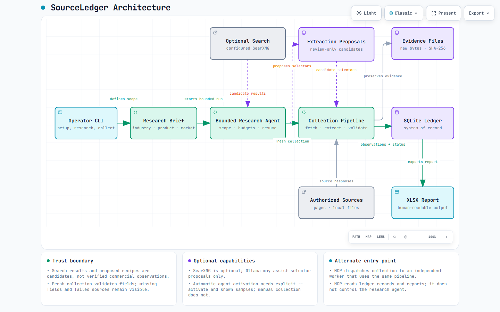

# SourceLedger

[English](README.md) | [한국어](README.ko.md)


SourceLedger is a local, evidence-first tool for researching sources, collecting product prices, preserving source material, and creating XLSX reports. It never estimates prices or substitutes missing values with zero.

Each collection records the source URL, UTC timestamp, raw fields, CSS/JSON/table location, evidence-file path, and SHA-256 hash. A row can be `verified` only when the product, price, and currency are supported by source evidence. A verified row is excluded from comparisons when its conditions are insufficient (`comparable=false`). For example, SourceLedger does not calculate a normalized unit price without source evidence of whether a price is for a pack or an individual item.

## How it works

[](docs/ARCHITECTURE.md)

The bounded agent turns source candidates into extraction proposals, collects fresh evidence, and records validated observations in SQLite before producing an XLSX report. Missing values remain missing. Optional search, model assistance, and activation have explicit limits.

Read the [architecture and Archify guide](docs/ARCHITECTURE.md) ([한국어](docs/ARCHITECTURE.ko.md)) for the code-backed flow, skill setup, and rebuild commands. Download [the interactive HTML](docs/architecture/sourceledger.html) and open it locally; GitHub shows its source rather than running the viewer. [Archify](https://github.com/tt-a1i/archify) is a documentation tool used to create this map.

## Quick start

Install with Python 3.11 or later.

```powershell
python -m venv .venv
.\.venv\Scripts\Activate.ps1
pip install -e ".[test,mcp]"
```

Browser collection requires the optional dependency and Chromium.

```powershell
pip install -e ".[browser]"
python -m playwright install chromium
```

The demo reads synthetic HTML and CSV fixtures only. It does not contain market prices.

```powershell
source-ledger run --config examples/demo.json
source-ledger status --config examples/demo.json --run-id <RUN_ID>
source-ledger observations --config examples/demo.json --run-id <RUN_ID>
source-ledger export --config examples/demo.json --run-id <RUN_ID>
source-ledger doctor
```

`su-crawler` remains a compatible command alias. Use `source-ledger` for new scripts and documentation.

Run a bounded batch with `run --max-tasks N`, then continue it with `run --resume <RUN_ID>`. Outputs are stored below the configured `output_dir`: a SQLite run history, source evidence, and an XLSX report.

## Configuration

Start a research workspace on first use. English is the default; `--lang ko` enables Korean setup prompts and next actions.

```powershell
source-ledger init
source-ledger research-status
```

Setup asks for industry, product, and market. It does not ask for an analysis purpose. Then register authorized source URLs, optionally discover links, supply exact identifiers, and create a collection draft. See [the getting-started guide](docs/GETTING_STARTED.md) for the complete workflow and [the roadmap](docs/ROADMAP.md) for remaining automation work.

The research workspace supports one product lead; collection configurations support multiple exact products. `draft` creates a manual starting point; `propose` can inspect source HTML and suggest extraction rules. Both remain separate from verified observations.

### Bounded research execution

Version 0.3 adds optional SearXNG keyword search, source-backed selector proposals, and a checkpointed controller. After setup, register authorized URLs and exact identifiers, then run:

```powershell
source-ledger product-set --identifier model=YOUR_EXACT_MODEL
source-ledger source-add --url "https://your-vendor.example/product"
source-ledger agent --run-dir .sourceledger/runs/run-001 --max-sources 3 --max-seconds 120
```

The agent proposes rules for selected sources, then performs a fresh combined collection and verification into SQLite and XLSX. Incomplete sources remain visible. `--resume` preserves saved scope and budgets; `--max-steps` pauses at a source boundary. External operations use bounded timeouts; the overall time budget is cooperative, not a hard process kill.

Keyword search requires an explicitly configured SearXNG server. Optional Ollama assistance accepts a configured loopback server with cloud disabled and an installed local model; model calls default to zero. Models return selectors only. Automatic activation additionally requires `--activate` and known samples covering every selected source. See the [automation guide](docs/AUTOMATION.md) for configuration, limits, and tested scope.

Configuration is JSON. Each product has `identifiers` to match against source material; each source has a fixed `location` and `product_ids`. A web source must list its URL host in `allowed_domains`. Internal material is limited to local file sources under `file_root`, or to authorized internal web sources. A file source may read only from its base directory or explicitly configured `file_root`.

```json
{
  "name": "Component price collection",
  "output_dir": "outputs",
  "products": [{"id":"part-a", "name":"Part A", "identifiers":{"model":"A-100"}}],
  "sources": [{
    "id":"vendor-a", "name":"Public catalogue", "kind":"web",
    "location":"https://example.com/catalog/a-100", "allowed_domains":["example.com"],
    "product_ids":["part-a"], "backends":["http", "playwright"],
    "selectors":{"model":".model", "price":".price", "currency":".currency"}
  }]
}
```

The XLSX report contains run summary, collection status, price comparison, observation history, source evidence, and review-required sheets. Comparisons use only verified, current, comparable observations. For each comparison condition, it uses one latest observation per source to calculate minimum, maximum, median, and count. `price_basis` (such as `pack` or `each`) and pack quantity are separate comparison conditions; without evidence they are not compared or normalized. A report covers one collection run, not a monthly historical-price report.

### Extraction rules and browser recipes

For HTML, `selectors` and optional `row_selector` retain a CSS location as evidence. CSV uses the `columns` header mapping; XLSX uses `sheet` and `columns`; JSON supports an array or `items`/`products`; PDF uses named capture groups in `pdf_pattern`. OCR for scanned PDFs is not implemented: documents without a text layer remain review items.

Set `profile_dir` to reuse a dedicated, already authenticated browser profile. It does not automate a login flow or enter credentials. A `recipe` contains only explicit page actions: `click`, `select`, `fill`, `wait_for`, and `assert_text`.

```json
"recipe": [
  {"action":"click", "selector":"button[data-tab='prices']"},
  {"action":"select", "selector":"select#pack", "value":"100"},
  {"action":"wait_for", "selector":".price", "state":"visible"},
  {"action":"assert_text", "selector":".currency", "text":"KRW"}
]
```

### Discovering URL candidates

`discover` reads one configured source and returns up to the requested number of URL candidates from HTML links or an XML sitemap. It tries each configured backend at most once, including Playwright after an HTTP failure or an empty link result. A policy denial stops fallback. Candidates are limited to HTTP(S) URLs in the same `allowed_domains`; fragments, duplicates, and URLs containing credentials are discarded.

```powershell
source-ledger discover --config examples/demo.json --source-id catalog --limit 100
```

`source-discover` saves these links as candidates in the research workspace. Review their relevance, trim the draft to intended sources, and supply selector/column mappings. Candidates never become verified price observations by discovery alone.

### Supported rental pages and conditional collection

`Product.price_profile` is `unit` by default. Set it to `rental` when a quote must retain rental conditions such as the term, mileage, deposit, advance payment, and installments. A deposit, an advance payment, and a deposit installment are separate observed conditions; SourceLedger does not combine or substitute them.

`Source.adapter` selects a deterministic parser for the supported rendered formats: `jetcar`, `gongcar`, or `funrent`. An adapter records source evidence and visibility. A price displayed in a calculator is marked `calculator_estimate`, remains distinct from an `observed` price, and is not silently promoted into a comparable quote. Hidden content, incomplete evidence, or incomplete rental conditions remains reviewable rather than comparable.

For a first supported-site collection, create a workspace so the industry, product, and market are explicit, then supply the exact authorized page URLs. Use a placeholder or your own authorized URL; this command does not discover or claim to complete a whole-site listing.

```powershell
source-ledger init
source-ledger collect-sites --workspace .sourceledger/workspace.json `
  --url "https://www.jetcar.kr/sub0201/<vehicle-id>" `
  --max-pages 5 --max-seconds 120
```

`collect-sites` accepts `--workspace`, one or more `--url` values, `--max-pages`, `--max-seconds`, and `--no-incremental`. It only accepts the currently supported Jetcar, Gongcar, and Funrent hosts, and collects supplied detail or rendered-calculator pages using reviewed read-only recipes. The collector blocks native form submission, but page JavaScript can still make other requests. It produces normal SQLite evidence history and an XLSX report. It does not perform whole-site listing discovery, infer unselected pages, or establish live inventory coverage.

The XLSX report adds a **Rental Quotes** sheet only when a run contains rental observations. It keeps observed monthly prices and calculator estimates in separate columns, then lists deposits, advance payment, and installments separately. **Observation History** also separates observed amount, estimated amount, raw fields, evidence, value origin, visibility, verification level, and rental conditions. Comparison statistics exclude calculator estimates and hidden-source values.

Ordinary `Source.incremental` is off by default and requires `"incremental": true`; it applies only to eligible public HTTP sources. `collect-sites` enables incremental retrieval for its generated public HTTP sources unless `--no-incremental` is supplied. A later run still contacts the source and may reuse retained bytes and extraction only after a matching conditional HTTP response. Browser sources are collected freshly. If retained evidence is missing or altered, SourceLedger does not send validators and obtains a fresh response. See the [collection reliability guide](docs/COLLECTION_RELIABILITY.md) ([한국어](docs/COLLECTION_RELIABILITY.ko.md)) and [Milestone 04](docs/MILESTONE_04.md).

### Verify and activate

This offline example checks two synthetic prices against known samples, writes a validation receipt, and creates an active configuration.

```powershell
source-ledger verify --config examples/verification.json --samples examples/verification.samples.json --receipt .sourceledger/verification.receipt.json
source-ledger activate --config examples/verification.json --receipt .sourceledger/verification.receipt.json --output .sourceledger/active.json
source-ledger run --config .sourceledger/active.json
```

Every configured product must have a source; every source/product task must be verified and have a current comparable observation. Activation rechecks the exact config, original evidence bytes, extracted fields, price validity, and any supplied samples. Changed rules, missing evidence, or an expired receipt require new verification. Receipts and active configs refuse overwrite; use a new filename for another version.

Without `--samples`, verification checks source consistency only. A receipt is a local audit record, not a signed guarantee of real-world accuracy. Existing `run --config` remains available for manually maintained configs; activation is an explicit workflow, not a mandatory runtime security boundary.

## MCP

The MCP server does not create the collection worker as its child process. On Windows, a client Job Object can terminate child processes when it exits. Start an independent worker in a normal terminal before starting MCP.

```powershell
# Terminal 1: independent worker
python -m su_crawler.worker --config examples/demo.json

# Terminal 2: stdio MCP server
source-ledger serve-mcp --config examples/demo.json
```

MCP rejects a collection request when it cannot see a worker heartbeat. Its tools register tasks, retrieve status and observations, and regenerate XLSX reports within the fixed configuration scope. `streamable-http` supports only local `127.0.0.1`.

## Current limits

- Keyword search requires your configured SearXNG instance. No shared/public search endpoint is silently chosen.
- Selector proposals support structured data and semantic HTML, with optional local model assistance. New browser action plans, automated login, and unattended rule self-repair are not implemented.
- SearXNG/Ollama request paths are tested with controlled responses; actual servers, models, and representative live sites remain to be validated. Loopback transport alone does not establish where a proxy executes a model; configure Ollama with cloud disabled.
- Claude and ChatGPT UI connections have not been verified. Remote ChatGPT use requires an authenticated deployment and an artifact download path.
- Crawl4AI is optional and has not been installed or validated against live sites in this environment.
- Services that incur cost or external transfer, including UWS, Jina, and Exa, are not connected.
- No paid MCP service is used by the supported-site collection flow.
- Agent-Reach informed the doctor/routing design but has no direct runtime integration. ego-lite depends on a macOS app path and is not directly integrated on Windows.
- Windows service installation and scheduling for continuous operation are not implemented.
- English is the default for CLI help, errors, and XLSX labels. Korean documentation, setup prompts, and research next actions are available; full Korean interface/report localization is not implemented.

## Before a real deployment

- SKU/model lists and required identifiers for each product
- Three to five target URLs and their authorized collection scope
- Human-verified price samples, including currency, tax, shipping, and member-price conditions
- De-identified internal CSV/PDF samples, or an authorized internal access path and account scope
- Business definitions for `price_basis`, pack quantity, unit-price calculation, and price type
- The intended connection target (Claude Desktop or ChatGPT) and its execution environment

Scanned-document OCR, autonomous browser navigation, rule recovery, and scheduled operation require further design and validation. ERP integration and analysis/simulation features are outside this scope.

See [implementation status](docs/STATUS.md) for implemented scope and validation.
